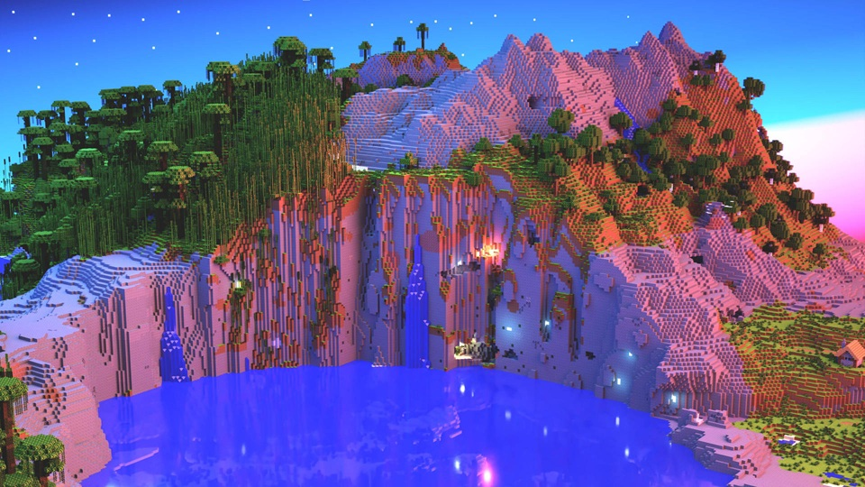

<div align="center">
  

  <h1>EndlessPixel Web</h1>

  <p><strong>Official website of EndlessPixel Server — a one-stop portal for downloads, profiles, status and smart Q&amp;A.</strong></p>

[](https://nextjs.org)
[](https://www.typescriptlang.org)
[](https://tailwindcss.com)
[](LICENSE)

English | [简体中文](./README.md)

</div>

---

## 📖 About

EndlessPixel Web is the official site of a **Java Edition** Minecraft server, built on the Next.js 16 App Router.

It is not a simple landing page — it is a **service portal** designed around what players actually need:

- New here and wondering how to join? Ask the AI assistant instead of digging through docs.
- Want to see your skin? Preview it in 3D, no client required.
- Looking for a launcher or mod-pack? 80+ resources with fast downloads.
- Is the server up? Real-time status at a glance.
- Signed in? Manage your profile info and skin in one place.

> ⚠️ **Edition policy**: the server supports **Java Edition** only (including mobile Java launchers such as POjavLauncher). **Not supported**: Bedrock Edition and web/browser clients.

---

## ✨ Features

| Feature | Description | Doc |
|---------|-------------|-----|
| 🤖 **AI Assistant** | Streaming Q&A with server context and knowledge base injected; can embed **interactive cards** (QQ group, server info) in replies | [ai-assistant.md](./README_docs/en/ai-assistant.md) |
| 🧍 **3D Skin Preview** | WebGL rendering of skins & capes (skinview3d); same-origin proxy with multi-level fallback — never a blank screen | [skin-preview.md](./README_docs/en/skin-preview.md) |
| 📦 **Launcher Downloads** | 80+ launchers and mod-packs in clear categories; built-in mirror acceleration and custom mirror support | [downloads.md](./README_docs/en/downloads.md) |
| 👤 **Profile** | Two-column on desktop (info left / skin right), single column on mobile; HMAC session auth | [profile.md](./README_docs/en/profile.md) |
| 📡 **Server Status** | Live online state, player count and version; graceful degradation when the API is down | [server-status.md](./README_docs/en/server-status.md) |

Also included: fully responsive layout (phone / tablet / desktop), dark mode, PWA offline support, and safe in-site link redirection.

---

## 🛠 Tech Stack

| Category | Technology |
|----------|-----------|
| Framework | Next.js 16 (App Router, SSR / SSG / ISR, Turbopack) |
| Language | TypeScript 5 (strict mode) |
| Styling | Tailwind CSS 4 (utility-first, dark mode out of the box) |
| 3D | skinview3d (WebGL skin rendering) |
| Quality | ESLint + Prettier |
| Misc | PWA (Workbox), HMAC session cookies |

---

## 🚀 Quick Start

### Prerequisites

- **Node.js** ≥ 18
- **npm** ≥ 9

### Run Locally

```bash
# Clone the repo
git clone https://github.com/EndlessPixel/server.git
cd server

# Install dependencies
npm install

# Start the dev server (HTTP)
npm run dev
```

Visit <http://localhost:3000>.

When HTTPS is required (e.g. debugging PWA or secure cookies):

```bash
npm run dev-https
```

Then visit <https://localhost:3000>.

### Available Scripts

| Command | Description |
|---------|-------------|
| `npm run dev` | Start the development server |
| `npm run dev-https` | Start the dev server over HTTPS |
| `npm run build` | Production build |
| `npm start` | Run the production build |
| `npm run lint` | ESLint check (zero warnings) |
| `npm run lint:fix` | Auto-fix lint issues |

---

## 📚 Documentation

| Doc | Contents |
|-----|----------|
| [Features Overview](./README_docs/en/features.md) | Module overview, tech stack, local run |
| [AI Assistant](./README_docs/en/ai-assistant.md) | Streaming, `<thinking>` reasoning, card rendering, link safety |
| [Skin Preview](./README_docs/en/skin-preview.md) | `/api/skin` proxy, fallback chain, skin-source notes |
| [Launcher Downloads](./README_docs/en/downloads.md) | Categories, mirror acceleration, edition policy |
| [Profile](./README_docs/en/profile.md) | Two-column layout, session security, legacy migration |
| [Server Status](./README_docs/en/server-status.md) | Status polling, degradation, API integration |

---

## 🤝 Contributing

Issues and Pull Requests are welcome.

1. Fork this repository
2. Create a feature branch: `git checkout -b feat/xxx`
3. Commit following [Conventional Commits](https://www.conventionalcommits.org/en/v1.0.0/): `git commit -m "feat: add xxx"`
4. Push the branch and open a Pull Request
5. Merge once CI passes and code review is done

**Before committing, run:**

```bash
npm run lint
npm run build
```

See [CONTRIBUTING.md](./CONTRIBUTING.md) for full guidelines.

---

## 📄 License

This project is licensed under **[GNU AGPL v3.0](./LICENSE)**.

Commercial use, modification and redistribution are allowed, but **modified network services must be open-sourced as well**.

---

## 💬 Get in Touch

- Issues & ideas: [open an issue](https://github.com/EndlessPixel/server/issues/new/choose)
- Discussions: [GitHub Discussions](https://github.com/EndlessPixel/server/discussions)
- Ban appeal: join QQ group **870594910**, or email <support@endlesspixel.cn>

---

<div align="center">
Star ⭐ and Watch 👀 are the best supports for us!
</div>
